# Standard-Pipeline: genau was passiert (Fließtext)

Dieses Dokument beschreibt den Deploy-Pfad `deploy_v2` so, wie er mit den **Standardwerten** von `OrchestratorConfig` läuft: ohne Sonder-Flags, ohne eigene `ExecutionPolicy`, ohne `config.json`. Es geht **der Reihe nach** durch den Code und sagt in **Klartext**, was in jeder Phase geschieht.

---

## Einordnung

Du lieferst einen **Text** (Prompt). Das Framework baut daraus Schritt für Schritt ein **World Model** (Architekturplan), prüft es, wandelt es in **OpenTofu-JSON** um und führt **OpenTofu** aus, damit **Docker-Container** starten. **Künstliche Intelligenz** wird für **Scope**, **World-Model-Extraktion** und den **semantischen Judge** genutzt; Resolver, Validator, Compiler und OpenTofu sind **regelbasiert** bzw. deterministisch.

Im Standard gilt: **Ollama** auf `http://localhost:11434`, Modell typisch **`qwen2.5-coder:32b`**, **Read-Timeout 1200 Sekunden** pro LLM-Request, **Resolver-Modus `deterministic`**, Arbeitsverzeichnis typisch **`honeynet_framework/output/`**, OpenTofu **lokal** (nicht im Docker-Container), Deploy-Befehle mit Timeout in der Größenordnung **900 Sekunden**.

---

## Übersicht (nur zur Orientierung)

```mermaid
flowchart LR
  subgraph prep [Start]
    A[Ollama + Preload]
    B[Katalog laden]
  end
  subgraph wm [World Model]
    C[Scope Intent]
    D[Extraktion LLM]
    E[Resolver]
    F[Katalog-Defaults]
  end
  subgraph gate [Prüfungen]
    G[Validator]
    H[WM-Repair]
    I[Judge]
    J[Semantic Repair]
  end
  subgraph iac [IaC]
    K[Compile]
    L[Dateien schreiben]
    M[Image-Resolve]
    N[Render main.tofu.json]
  end
  subgraph run [Laufzeit]
    O[plan/apply]
    P[Verify + QA]
    Q[Telemetrie]
  end
  A --> B --> C --> D --> E --> F --> G --> H --> I --> J --> K --> L --> M --> N --> O --> P --> Q
```

---

## Phase 1: Orchestrator startet (`initialize`)

Sobald `deploy_v2` den Orchestrator initialisiert, passiert Folgendes.

Es wird ein **LLM-Provider** erzeugt. Bei Ollama bedeutet das einen **HTTP-Client** mit festen Timeouts: Verbindungsaufbau und Schreiben sind kurz begrenzt, das **Lesen der Antwort** darf so lange dauern wie `llm_config.timeout` (standardmäßig 1200 Sekunden). Jeder Aufruf an Ollama — inklusive des ersten — blockiert also höchstens so lange, bis entweder die komplette HTTP-Antwort da ist oder diese Grenze erreicht ist.

Wenn **`preload_ollama_model`** aktiv ist und der Provider Ollama heißt, schickt das Framework **einen minimalen Chat** („Hi“) an das konfigurierte Modell und setzt **`keep_alive`** so, dass das Modell im Speicher bleibt. Praktisch: Beim **ersten** Lauf kann dieser eine Request **sehr lange** brauchen, weil Ollama das Modell erst in den Arbeitsspeicher laden muss, bevor überhaupt Bytes der Antwort zurückkommen. Das ist derselbe Read-Timeout wie bei allen späteren LLM-Aufrufen.

Parallel werden die Bausteine instanziiert, die den Rest der Pipeline tragen: **`WorldModelExtractor`** erhält den **Resolver-Modus** aus der Konfiguration (Standard **`deterministic`**). Dazu kommen **`WorldModelValidator`**, **`SemanticJudge`** (wenn nicht abgeschaltet), **`DeployCompiler`**, **`TerraformDeployer`** für OpenTofu, **`RuntimeVerifier`** für spätere Checks, **`QARunner`** für QA nach dem Deploy, und bei aktivierter Telemetrie **`TelemetryCollector`** und **`MetricsReporter`**.

Anschließend prüft der Deployer die **Voraussetzungen**: OpenTofu bzw. Terraform-CLI und Docker müssen so erreichbar sein, dass ein Deploy sinnvoll möglich ist. **Schlägt diese Prüfung fehl**, bricht die Initialisierung mit einem **Fehler** ab — es wird kein World Model gebaut.

Wenn kataloggeführte Generierung eingeschaltet ist, wird in dieser Phase außerdem versucht, den **Katalog-Snapshot** vorzuladen (siehe Phase 2). So merkst du fehlende oder kaputte Katalogdaten früh.

---

## Phase 2: Katalog für den Lauf bereitstellen

Der Katalog ist die **einzige autoritative Liste**, welche **Archetypen** (welche Docker-Images mit welcher Rolle) überhaupt infrage kommen und welche **Metadaten** (Ports, Env, Semantik) dazu gespeichert sind.

Im Standard ist **`catalog_sync_on_startup`** wahr: Das Framework versucht, den Snapshot zu **aktualisieren** (Synchronisation mit den konfigurierten Quellen, z. B. offizielle Image-Dokumentation). **Schlägt das fehl**, greift bei **`catalog_offline_ok=True`** der **Fallback**: Es wird der **zuletzt gespeicherte Snapshot** von der Platte geladen, sofern er existiert und lesbar ist.

Beim **Öffnen** des Snapshots können mehrere **Aufarbeitungsschritte** laufen. **`catalog_hydrate_runtime_on_load`** (Standard an) kann fehlende **Laufzeit-Metadaten** nachziehen — etwa ob ein Container einen sinnvollen Startbefehl hat. Zusätzlich kann **`hydrate_semantic_profiles()`** die Einträge mit **semantischen Facets** aus der Datei **`honeynet_framework/catalog/semantic_taxonomy.yaml`** (neben `semantic_inference.py`, nicht unter `docs/`) anreichern oder aktualisieren, damit später Resolver und Regeln konsistente Begriffe sehen. Fehlt die Datei, liefert der Loader eine leere Taxonomie (Warnung im Log).

**Gibt es am Ende keinen brauchbaren Snapshot** (leer, fehlend, nicht lesbar) und hilft auch der Offline-Fallback nicht, endet **`deploy_v2`** mit einem Fehler in der Stufe **`catalog_snapshot`**. Dann kommt **keine** World-Model-Extraktion.

---

## Phase 3: Scope Intent — erste LLM-Runde

Das Framework ruft **`extract_scope_intent`** auf. Der **Nutzerprompt** (und ggf. Szenario-Kontext aus Benchmarks) geht in die KI. Die Antwort ist kein vollständiges Honeynet, sondern ein **Steuerobjekt**: typischerweise **Skalierungsstufe** (`scale_intent`), **minimale und maximale** Anzahl an Containern, **minimale** Anzahl an **Zonen** und **Netzen**, **Pflicht-Domänen** (Themen wie Datenbank, Identity) und ob **Redundanz** erwünscht ist.

Diese Werte steuern **nur**, wie **groß** und **breit** die nächste Extraktion ausfallen soll. Sie ersetzen **nicht** die eigentliche Systemliste; sie sind die **Rahmengröße** für den nächsten Schritt.

---

## Phase 4: World Model extrahieren — zweite große LLM-Runde

Jetzt ruft das Framework **`extract`** auf. Eingaben sind der **Prompt**, das **Scope Intent**-Objekt und — wenn der Katalog aktiv ist — ein **Katalog-Kontext** (u. a. Pflicht-Technologien, Required-Archetypen, keine riesige „Errätliste“ im Resolver-Standard).

Die KI soll **gültiges YAML** liefern, das ein **World Model** beschreibt: **Organisation**, **Zonen** mit Netz- und Simulationsdaten, **Systeme** mit je **`deploy`** (Zone, Image-Felder, Abhängigkeiten, …) und **`simulate`** (Rollen, Verhalten), dazu optional **Identities**, **Secrets**, **Artifacts**, **Runtime** usw.

Im **Standard-Resolver-Modus** (`deterministic`) ist das Prompt-Schema so gebaut, dass pro deploybarem System vor allem ein Block **`requirement`** entstehen soll: strukturierter **Kind** (z. B. Datenbank, Identity), Liste **`capabilities_needed`**, **`zone_affinity_hint`**, **`role_description`**, optional **`hard_technology`** wenn der Nutzer explizit z. B. „Kafka“ oder „Postgres“ genannt hat. Die **lange Retrieval-Liste „SCOPED CATALOG CANDIDATES“**, aus der die KI früher primär Archetypen erraten sollte, wird in diesem Modus **nicht** als Hauptauswahlhilfe eingebaut. **REQUIRED TECHNOLOGY**-Einträge aus dem Szenario bleiben wichtig, wo Technologien **hart** vorgegeben sind.

Die Rohantwort wird geparst, Kind-Felder normalisiert, und es folgen die nächsten Phasen innerhalb des Extractors (Resolver, dann Katalog-Defaults — siehe unten).

---

## Phase 5: Resolver — Archetypen aus Requirements

Für jedes System, das ein **`requirement`**-Objekt trägt, läuft der **CatalogResolver**. Er arbeitet **ohne** zweite freie KI-Wahl aus dem gesamten Katalog: Er **filtert** Kandidaten (Dienst tauglich, Kategorie passt zum Kind, ggf. **`hard_technology`** muss zum Image passen), **schließt** Einträge aus, deren **`roles_disallowed`** mit den geforderten Fähigkeiten kollidiert, und **bewertet** den Rest nach Überlappung der gewünschten Capabilities mit den Katalog-Facets sowie nach **Zonenaffinität**; bei Verstoß gegen **`zone_forbidden`** fliegt ein Kandidat raus. Die verbleibenden Kandidaten werden **stabil sortiert** (Score, dann Name), damit wiederholbare Läufe dasselbe Ergebnis liefern.

**Ein eindeutiger Spitzenreiter** führt dazu, dass **`deploy.archetype`** auf diesen Archetyp gesetzt wird und **`archetype_source`** z. B. **`resolver_unique`** trägt. **Mehrere** ähnlich gute Kandidaten ergeben Status **ambiguous**; im Modus **`deterministic`** (Standard) entscheidet **keine** zusätzliche Mini-LLM-Runde — die Mehrdeutigkeit bleibt oder wird später von anderen Schritten aufgefangen. **Niemand** passt: Status **none**, das wird **sichtbar** protokolliert (Info/Warn), und es gibt keinen Resolver-Archetyp für dieses System.

Systeme **ohne** `requirement`, die trotzdem einen Archetyp im YAML haben, können später als **`legacy_llm_direct`** markiert werden, damit die **Herkunft** des Archetyps dokumentiert bleibt.

---

## Phase 6: Katalog-Defaults — technische Felder auffüllen

Anschließend läuft **`apply_catalog_defaults_to_system`** für jedes System. Aus dem **gewählten Archetyp** werden die im Katalog hinterlegten **Images**, **Umgebungsvariablen**, **Ports**, **Standardbefehle**, **Health-/Env-Spezifikationen** usw. mit den Regeln des Frameworks **zusammengeführt** und in **`deploy`** geschrieben.

**Wichtig:** Wenn ein **`requirement`** gesetzt ist, wird **nicht** mehr der alte Pfad ausgeführt, der bei „unpassendem“ ersten Treffer einen **anderen** Archetyp per Retrieval **still ersetzt** hätte. Die Resolver-Wahl bleibt die **primäre** Archetyp-Entscheidung; es werden nur noch **Felder** ergänzt, nicht die Archetyp-Wahl verworfen.

Wo die Herkunft noch nicht gesetzt war, kann **`archetype_source`** **`catalog_defaults_fallback`** werden — das dokumentiert, dass der Archetyp vor allem über diesen Nachbearbeitungspfad konsolidiert wurde.

---

## Phase 7: Lauf-Diagnostik

Nach der Extraktion schreibt der Orchestrator in die **Run-Diagnostik** unter anderem **`resolver_mode`** (z. B. `deterministic`) und **`resolver_stats`**: das zählt, wie viele Systeme welche **`archetype_source`**-Werte haben. So siehst du später in Reports, ob Archetyme überwiegend vom Resolver kamen oder über Legacy-Pfade.

---

## Phase 8: World Model validieren

Der **`WorldModelValidator`** prüft das Modell gegen **fest codierte Regeln** und **Katalog-Policies**: u. a. ob Archetypen existieren, Zonen konsistent sind, Abhängigkeiten plausibel sind und technische Verträge eingehalten werden.

**Schlägt die Prüfung fehl** und **`world_model_repair_mode`** ist an, startet die **`WorldModelRepairLoop`**. Die Reparatur arbeitet **in Stufen** (Tier 1 und Tier 2): Es werden deterministische Korrekturen versucht, das Modell erneut validiert, und das wiederholt sich bis zu den konfigurierten Grenzen. Es geht **nicht** darum, mit der KI das ganze YAML neu zu träumen, sondern gezielt Regelverletzungen zu beheben.

**Bleiben danach noch blockierende Fehler**, stoppt die Pipeline mit der Fehlerstufe **`world_model_validation`**. Es gibt **keinen** Compiler-Lauf und **keinen** Deploy.

---

## Phase 9: Semantischer Judge

Wenn **`enable_semantic_judge`** wahr ist, bekommt ein **zweites LLM** den **Originalprompt** und das **fertige World Model** (und ggf. den Katalogkontext). Es soll bewerten, ob die **Architektur zur Story passt**: fehlende Kern-Dienste, falsche Zonen, kaputte Abhängigkeiten, grobe Rollen-Widersprüche. Der Prompt ist im Standard so ausgerichtet, dass **Struktur** wichtiger ist als das Nörgeln an jedem einzelnen Archetyp-Namen.

Das Ergebnis enthält **`passed`**, eine **Score**, eine **Zusammenfassung** und eine Liste **Findings** mit Schweregrad. Wenn **`judge_fail_on_error_findings`** wahr ist, führt **jede** Finding mit Schwere **error** oder **critical** oder ein explizites **`passed: false`** zum **Abbruch** der Pipeline mit Stufe **`semantic_judge`** — ohne OpenTofu-Deploy.

---

## Phase 10: Semantische Reparatur (begrenzt)

Wenn **`enable_semantic_repair`** wahr ist und der Judge **Fehler-Findings** geliefert hat, darf **höchstens `max_semantic_repair_passes`** (Standard **1**) Reparatur-Runde laufen. Die **`SemanticRepairLoop`** versucht, das World Model **an die Findings anzupassen** — etwa fehlende Dienste ergänzen oder problematische Archetypen tauschen; wo ein **`requirement`** existiert, soll **Resolver-Logik** statt freiem Retrieval bevorzugt werden.

Nach der Reparatur wird das Modell **erneut validiert**. Schlägt die Validierung fehl, kann das Framework auf den **Zustand vor der Reparatur** zurückspringen und die Schleife verlassen. **Erneut** wird der Judge nicht endlos aufgerufen — die Pass-Anzahl ist klein gehalten.

---

## Phase 11: Kompilieren — World Model wird zur DeployProjection

Der **`DeployCompiler`** übersetzt das validierte World Model in eine interne **`DeployProjection`**: eine Liste von **Containern**, **Netzwerken**, **Volumes**, **Abhängigkeiten** und allem, was die spätere IaC-Schicht braucht. **Kein LLM** ist in dieser Stufe beteiligt. Obergrenzen für Container- und Netzanzahl werden aus **Scope Intent** und dem tatsächlichen Modell abgeleitet.

**Schlägt die interne Validierung des Compilers fehl**, endet der Lauf mit Stufe **`deploy_compilation`**.

---

## Phase 12: Dateien schreiben

Das serialisierte World Model landet als **`world_model.yaml`** (oder `.json`, falls YAML nicht verfügbar ist) im **Arbeitsverzeichnis**. Wenn ein Judge-Ergebnis existiert, wird **`semantic_judge.json`** geschrieben. So hast du den Plan und das Urteil **revisionssicher** auf der Platte, bevor die Infrastruktur gerendert wird.

---

## Phase 13: Host-Ports bei Bedarf umbiegen

Bevor die endgültige IaC-Datei entsteht, kann das Framework **Host-Port-Kollisionen** erkennen und **freie Ports** zuordnen. Das passiert **deterministisch** auf der Projektion. Es entstehen **Warnungen** im Lauf; der Deploy wird dadurch **nicht** automatisch abgebrochen, sofern keine andere Regel greift.

---

## Phase 14: Image-Auflösung gegen die Registry

Wenn **`enable_registry_resolution`** wahr ist, läuft der **`ImageResolver`** über die Container der Projektion und versucht, Image-Referenzen **aufzulösen** — etwa **Digests** zu setzen, wo die Registry mitspielt. **Weiche** Fehler können als Warnungen durchgereicht werden. **Harte**, blockierende Unauflösbarkeiten führen bei **`abort_on_unresolved_images=True`** zum **Abbruch** mit Stufe **`image_resolution`**, damit nicht mit völlig unbekannten oder nicht erreichbaren Images deployt wird.

---

## Phase 15: Execution Policy

Im Standard ist **`execution_policy`** **`None`**. Es gibt **keinen** zusätzlichen Schritt, der Registry-Allowlists, Digest-Pflicht oder Topologie-Gates **erzwingend** prüft. Solche Mechanismen wären optional und müssten explizit konfiguriert werden.

---

## Phase 16: Render — OpenTofu JSON erzeugen

Der **`TofuRenderer`** schreibt aus der (ggf. für Log-Aggregation angepassten) Projektion die Datei **`main.tofu.json`** ins Arbeitsverzeichnis. Das ist die **konkrete Bauanweisung** für OpenTofu im JSON-Format.

Im Standard ist **`enable_log_aggregation`** **aus**. Es werden **keine** zusätzlichen Log-Sammel-Container oder Mounts für zentrale Log-Aggregation eingeschleust; die Projektion entspricht der normalen Kompilat-Ausgabe.

---

## Phase 17: OpenTofu ausführen — Plan und Apply

Wenn **`cleanup_before_deploy`** wahr ist, räumt das Framework vor dem eigentlichen Apply auf, was von **früheren Läufen** noch im Weg sein könnte (Container/Netze dieses Laufs), damit **init/plan/apply** nicht an Altlasten scheitern.

Der **`TerraformDeployer`** führt die klassische Kette **init**, **validate**, **plan**, **apply** mit dem **lokalen** OpenTofu-Binary aus (nicht im Docker-Wrapper, solange `use_docker_for_tofu` falsch ist). **Schlägt** eine Stufe dauerhaft fehl, endet der Lauf mit der entsprechenden **failure_stage** (`init`, `validate`, `plan` oder `apply`).

Die **`RuntimeRecoveryLoop`** kann bei **bestimmten** Fehlerarten **wenige Wiederholungen** einbauen: erneut aufräumen und erneut planen/anwenden. Es gibt **keinen** LLM-Schritt, der Terraform-Code „repariert“ — nur deterministische Wiederholung und Cleanup.

---

## Phase 18: Laufzeit-Verifikation

Nach erfolgreichem Apply prüft der Deployer, ob die **vorgesehenen Container** laufen und ob sie als **gesund** gelten (im Rahmen der implementierten Checks). Daraus entsteht ein **Runtime-Zustand**: alles da und gesund → eher **`DEPLOYED`**; teilweise Probleme → eher **`RUNTIME_DEGRADED`**; komplett schief → **`FAILED`**. Der **`RuntimeVerifier`** fasst die Information für die Auswertung zusammen.

---

## Phase 19: QA nach dem Deploy

Wenn **`enable_qa`** wahr ist und **mindestens ein Container** läuft, führt der **`QARunner`** definierte Checks aus — typischerweise Erreichbarkeit von Ports oder ähnliche Smoke-Tests. Das Ergebnis landet in einer **QA-Datei** (z. B. **`qa_report.json`**). **Schlägt** QA fehl, werden oft **Warnungen** angehängt; der Gesamtstatus kann trotzdem noch „deployed“ sein, je nach Logik der Auswertung. **Läuft** kein Container oder ist QA aus, wird ein Report mit **`skipped_reason`** geschrieben.

---

## Phase 20: Telemetrie und Laufberichte

Ist **`enable_telemetry`** wahr, schreibt das Framework **Ereignisse** (z. B. als JSONL) und **Metriken** unter **`work_dir/telemetry/`**. Am Ende eines Laufs können **Zusammenfassungen** und Berichte (z. B. unter **`runtime_metrics`**) erzeugt werden, damit Auswertungen und das Dashboard später befüllt werden können.

---

## Was im Standard absichtlich wegbleibt

Ohne explizite Umstellung nutzt das Framework **keinen** Cloud-LLM-Anbieter wie OpenAI oder Anthropic. Ohne gesetzte **`execution_policy`** gibt es **keine** zusätzliche Policy-Schicht für Registry oder Topologie. Ohne **`enable_log_aggregation`** kommt **kein** eingebauter Log-Aggregator in die Container-Liste. Eine **`config.json`** oder CLI-Flags ändern **Parameter** (Modell, Timeout, Pfade), aber nicht die **logische Reihenfolge** der oben beschriebenen Phasen.

---

## Wo im Code nachlesen

Die beschriebene Kette sitzt vor allem in **`HoneynetOrchestrator.deploy_v2`** (`honeynet_framework/orchestrator.py`). Konfiguration: **`OrchestratorConfig`** und **`LLMConfig`**. Extraktion und Resolver: **`WorldModelExtractor`**, **`catalog_resolver`**. Katalog-Nachbearbeitung: **`catalog_inference.apply_catalog_defaults_to_system`**. Validierung und WM-Reparatur: **`WorldModelValidator`**, **`WorldModelRepairLoop`**. Judge und semantische Reparatur: **`SemanticJudge`**, **`SemanticRepairLoop`**. Compile und Render: **`DeployCompiler`**, **`TofuRenderer`**. Registry: **`ImageResolver`**. Deploy: **`TerraformDeployer`**. Telemetrie: **`TelemetryCollector`**, **`MetricsReporter`**, **`write_runtime_run_reports`**.

---

*Stand: Fließtextbeschreibung der Standard-Pipeline; bei Abweichung zwischen Dokument und Code gilt der Code.*
