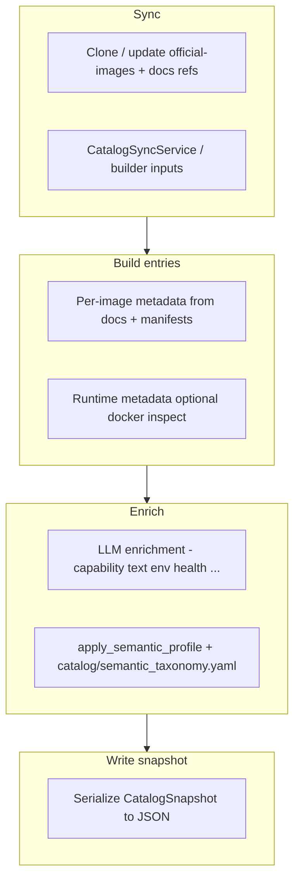
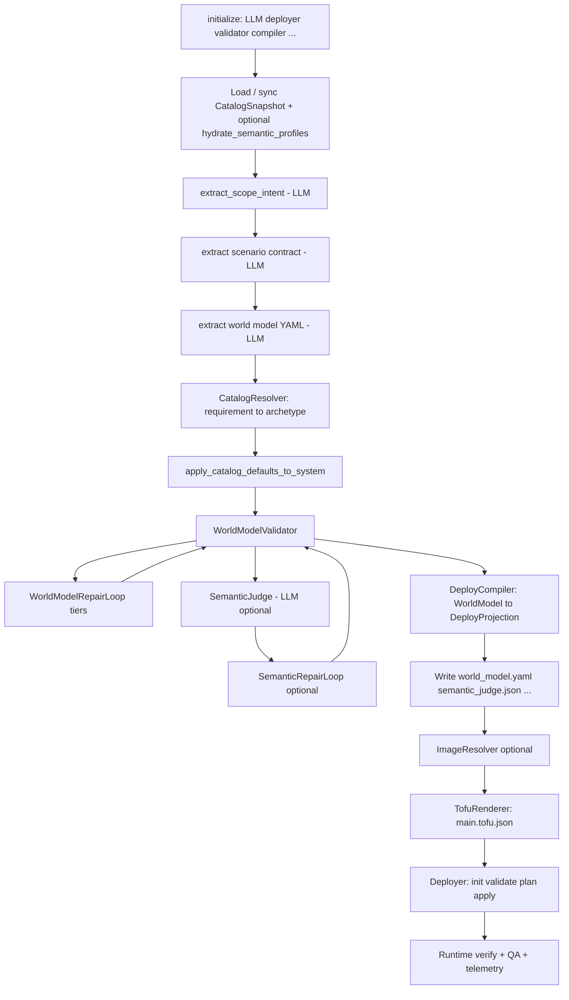

# Honeynet Framework — End-to-End Workflow (In Depth)

This document explains **what the framework does**, **in what order**, and **which modules own which responsibility**. It is meant as the “big picture” companion to the phase-by-phase German walkthrough in [`DEFAULT_PIPELINE_DE.md`](./DEFAULT_PIPELINE_DE.md).

**If anything here disagrees with the code, the code wins.**

---

## 1. Invoking the CLI and config defaults

- **Module form (reliable from a project venv):**  
  `python -m honeynet_framework.cli <subcommand> …`
- **Installed entry point:** after `pip install -e .`, setuptools exposes the **`honeynet`** console script (under `.venv\Scripts\` on Windows, or on global `PATH` if installed that way).
- **Windows PowerShell:** the shell does not run programs from the current directory by default—use a qualified path (e.g. `.\.venv\Scripts\honeynet.exe`) or ensure the venv **`Scripts`** directory is on `PATH` (e.g. after `Activate.ps1`). If script execution is restricted, use **`python -m honeynet_framework.cli`** or a small **`honeynet.cmd`** wrapper in the repo root, if present.
- **Persistent defaults** for deploy-related flags (LLM provider, model, URL, API key, timeouts, …) load from **`~/.honeynet/config.json`**—on Windows typically **`%USERPROFILE%\.honeynet\config.json`**—see `_load_config_defaults` in `honeynet_framework/cli.py`. CLI flags still override these values.

---

## 2. Mental model: two separate lifecycles

Most confusion comes from mixing these two:

| Lifecycle | When | Purpose | Typical command |
|-----------|------|---------|-----------------|
| **A. Catalog (offline)** | Before / beside deploy runs | Build a **curated, enriched snapshot** of Docker images (archetypes, env, health, semantics) | `python -m honeynet_framework.cli catalog build` / `rebuild --extended` |
| **B. Deploy (runtime pipeline)** | When you “deploy a honeynet” | Turn a **natural-language prompt** into a **World Model**, validate it, render **OpenTofu JSON**, run **plan/apply** | `python -m honeynet_framework.cli deploy` (uses `HoneynetOrchestrator.deploy()`) |

- **Catalog** answers: *“What images exist, what are they allowed to do, and what metadata do we trust?”*
- **Deploy** answers: *“Given this story, which subset of the catalog should run, how are they wired, and can we apply it?”*

They interact: deploy **reads** the catalog; it does not rebuild the full catalog unless you configured sync-on-startup.

---

## 3. Repository layout (where to look)

| Area | Path | Role |
|------|------|------|
| CLI entry | `honeynet_framework/cli.py` | Parses commands (`deploy`, `generate`, `destroy`) |
| Orchestration | `honeynet_framework/orchestrator.py` | **`HoneynetOrchestrator.deploy()`** — main deploy pipeline |
| Extraction | `honeynet_framework/extraction/extractor.py` | World model extraction + image repair (LLM) |
| Prompts | `honeynet_framework/extraction/prompts.py` | System/user messages for extraction and repair |
| YAML parsing | `honeynet_framework/extraction/yaml_parsing.py` | Parse/repair YAML from LLM responses |
| LLM providers | `honeynet_framework/llm.py` | `LLMProvider` abstraction, Ollama/OpenAI backends |
| Catalog snapshot | `honeynet_framework/catalog/snapshot.py` | `CatalogEntry`, `load_catalog_snapshot()` |
| Catalog resolver | `honeynet_framework/catalog/resolver.py` | `apply_catalog_resolution()` — archetype → image from snapshot |
| Validation | `honeynet_framework/validator.py` | Structural rules (`STRUCTURAL_RULES`) on WorldModel |
| Failure report | `honeynet_framework/failure_report.py` | Classified validation errors (type, severity) |
| Image resolver | `honeynet_framework/image_resolver.py` | Docker manifest inspect, digest pinning, soft/blocking |
| Semantic judge | `honeynet_framework/semantic_judge.py` | Optional LLM “does this match the story?” |
| Compile | `honeynet_framework/deploy_compiler.py` | **WorldModel → DeployProjection** (no LLM) |
| Render | `honeynet_framework/tofu_renderer.py` | **DeployProjection → `main.tofu.json`** |
| Apply | `honeynet_framework/deployer.py` | OpenTofu **init/validate/plan/apply**, runtime verify |
| QA | `honeynet_framework/qa.py` | Post-deploy checks (container, TCP, HTTP) |
| Metrics | `honeynet_framework/metrics.py` | `DeploymentMetrics` — thesis deployability + scenario fit |
| Telemetry | `honeynet_framework/telemetry_events.py` | Append-only JSONL events per pipeline stage |
| Plugins | `honeynet_framework/plugins/registry.py` | Entry-point discovery (`honeynet.repair_strategy`, `honeynet.catalog_pack`) |
| Pipeline enums | `honeynet_framework/enums_pipeline.py` | `FailureStage` enum |
| Types | `honeynet_framework/models/` | **WorldModel**, **DeployProjection**, **DeploymentResult**, enums, zones, systems |

> **Note:** Earlier versions of this document referenced modules that do not exist in the current codebase:
> `catalog_resolver.py` (root), `catalog_inference.py`, `world_model_validator.py`, `world_model_repair.py`,
> `semantic_repair.py`, `catalog/builder.py`, `catalog/enricher.py`, `catalog/semantic_inference.py`,
> `pipeline/pipeline.py`. These were aspirational — see `docs/ARCHITECTURE_STATUS.md` for current status.

---

## 4. Lifecycle A — Catalog build (offline)

### 4.1 What gets produced

Typical outputs live under **`~/.honeynet/catalog/`** (on Windows: **`%USERPROFILE%\.honeynet\catalog\`**; exact paths depend on your environment and CLI flags):

- **`catalog_enriched.json`** (or similar) — large JSON: list of **`entries`**, each an **`ImageCatalogEntry`**-shaped record
- **`catalog_build_meta.json`** — build/sync metadata
- **`user_extended.json`** — optional user extensions

The JSON documents **field provenance** (e.g. which fields came from LLM enrichment vs runtime probes) — see the `field_provenance` block at the top of `catalog_enriched.json`.

While building, the catalog pipeline also uses a **working cache** under the framework **work dir** (default often `honeynet_framework/output`), e.g. **`.cache/catalog/`**, for synced upstream repos and intermediate data—see `run_catalog` / `CatalogSyncService` in `cli.py` and `honeynet_framework/catalog/`.

### 4.2 High-level stages



**Important modules (current implementation)**

- **`honeynet_framework/catalog/snapshot.py`** — `CatalogEntry` dataclass, `load_catalog_snapshot()` loader.
- **`honeynet_framework/catalog/resolver.py`** — `apply_catalog_resolution()` maps `catalog_archetype` to images from the snapshot.

> **Note:** `catalog/builder.py`, `catalog/enricher.py`, `catalog/sync_service.py` are aspirational — not yet implemented. See `ARCHITECTURE_STATUS.md`.

**Runtime prerequisites (catalog commands)**

- **`docker`** must be **on `PATH`** for pre-pull and for **`docker inspect`**-style runtime metadata. If `docker` is missing, Windows often reports **`[WinError 2]`** (“file not found”) on pre-pull—the executable being started is `docker`, not the image name.
- **LLM for enrichment:** `run_catalog` in `cli.py` constructs an **Ollama** client at **`http://localhost:11434`** (fixed for catalog build/update/rebuild/refresh paths). Ensure Ollama is running and the **`--catalog-model`** you pass is pulled (default in CLI: **`llama3.1`**).

### 4.3 Semantic taxonomy file (`honeynet_framework/catalog/semantic_taxonomy.yaml`)

**Location:** The framework loads it from the **Python package** path next to `semantic_inference.py` (`Path(__file__).with_name("semantic_taxonomy.yaml")`). In a source checkout that is **`honeynet_framework/catalog/semantic_taxonomy.yaml`**. It is easy to assume a path under **`docs/`** or the repo root—that is **incorrect**.

**If the file is missing** (deleted tree, incomplete install): `load_semantic_taxonomy()` catches `OSError` / parse errors, logs a warning, and returns **`{}`** — inference still runs, but **no taxonomy-driven facet terms** are applied.

It is **not** a list of every catalog row. It is a **small rulebook** of semantic **facets** (e.g. roles, capabilities, zone/data affinities). For **each** catalog entry, `semantic_inference.py`:

1. Builds a text corpus from archetype, image ref, docs, labels, startup notes, ports, etc.
2. Scores each taxonomy term (keywords, identifiers, optional category/port bonuses).
3. Assigns **lists** like `roles_supported`, `capabilities_provided`, … plus **`semantic_confidence`** / **`semantic_evidence`**.

Entries with **no matching terms** get **empty facet lists** — that is normal and means “taxonomy did not confidently tag this image.”

### 4.4 CLI surface

Defined in `cli.py` under the **`catalog`** subcommand:

- **`build`** — full pipeline: sync + enrich + **Tier-B extended** set (see `CatalogBuilder.build_snapshot_async`: `rebuild_extended=True` for `build`).
- **`update`** — incremental update (hash-based); does **not** force a full rebuild and does **not** run the Tier-B extended pass unless you use **`build`** / **`rebuild --extended`** (`rebuild_extended=False`, `force_rebuild=False` for `update` in `run_catalog`).
- **`rebuild`** — force rebuild (`force_rebuild=True`); optional **`--extended`** to include the same Tier-B extended pass as **`build`**; optional **`--parallel N`** (default 4) for extended builds; optional **`--skip-pull`** to skip **`docker pull`** pre-pulls (useful when images are already local or `docker` is temporarily unavailable—note that other steps may still invoke Docker).
- **`add`** — add one image ref to the user extended list.
- **`refresh`** — refresh one official or extended entry.
- **`status` / `show`** — inspect snapshot path, counts, or one archetype JSON.

Global CLI flags such as **`--llm-timeout`** apply where parsed; catalog enrichment uses the **`--catalog-model`** argument on the `catalog` parser.

---

## 5. Lifecycle B — Deploy pipeline

### 5.1 Entry points

- **CLI:** `honeynet deploy …` → `_run_deploy` in `cli.py` → **`HoneynetOrchestrator.deploy(prompt)`**.
- **Programmatic:** `await orchestrator.deploy(prompt)` — calls `initialize()` internally before work proceeds.

### 5.2 One diagram for the whole deploy path



### 5.3 Phase-by-phase (concise)

The following mirrors the **logic** described in detail (German) in **`DEFAULT_PIPELINE_DE.md`**. Numbers here are for orientation only.

1. **`initialize()`** (`orchestrator.py`)  
   - Builds LLM client, extractor, validator, compiler, deployer, optional telemetry/QA.  
   - Checks **OpenTofu/Terraform + Docker** prerequisites when required.  
   - May **preload** the Ollama model (first call can be slow).

2. **Catalog snapshot** (`_get_catalog_snapshot`)  
   - Optionally **sync** on startup (`catalog_sync_on_startup`).  
   - Load from disk / cache; optional **runtime hydration** of entries.  
   - **`hydrate_semantic_profiles()`** re-applies taxonomy-based semantics on load when enabled — keeps resolver inputs consistent with the current **`honeynet_framework/catalog/semantic_taxonomy.yaml`** on disk.

3. **Scope intent** (`extract_scope_intent` in extractor)  
   - LLM returns **scale**, min/max containers, zones, mandatory **domains**, redundancy hints.  
   - Controls **how big** the next extraction should be — not the final system list by itself.

4. **Scenario contract** (extractor)  
   - LLM extracts structured **required technologies**, roles, zone themes, etc.  
   - Used later by **validator** (e.g. `SCENARIO_REQUIRED_TECH`) and scope warnings (`SCOPE_DOMAIN_MISSING`).

5. **World model extraction** (`extract` in extractor)  
   - LLM emits **YAML** for zones, systems, deploy/simulate blocks, dependencies, secrets, etc.  
   - In **deterministic resolver mode**, systems are encouraged to carry a **`requirement`** object (kind, capabilities, hints, optional **`hard_technology`**) instead of guessing archetypes from a huge candidate dump.

6. **Optional catalog resolution** (`catalog/resolver.py`)
   - If `--catalog-path` is set: maps `catalog_archetype` on each system to `default_image` from the snapshot.
   - Sets `deploy.image` from the catalog entry.

7. **World model validation** (`validator.py`)
   - Structural rules (`STRUCTURAL_RULES`): zone refs, images, deps, ports, cycles.
   - Failures are **hard stops** before compile — unless a repair strategy plugin fixes them.

8. **Repair strategies** (`plugins/registry.py`, entry-point `honeynet.repair_strategy`)
   - Discovered via `importlib.metadata`; each receives `(world_model, failure_report)` → returns repaired WorldModel.
   - Orchestrator tries each strategy on validation failure; re-validates after each.

9. **Image validation + LLM repair loop** (`image_resolver.py`, `extraction/extractor.py`)
   - `resolve_images()` checks each image via `docker manifest inspect`.
   - On failure: LLM suggests replacements (`repair_images()`); up to `max_image_repair_attempts`.

10. **Semantic judge** (`semantic_judge.py`) — optional
    - LLM pass: “does this architecture match the user story?”
    - Can **fail the run** if `judge_fail_on_error` is set.

11. **DeployCompiler** (`deploy_compiler.py`)
    - **WorldModel → DeployProjection** (containers, networks, volumes, deps).
    - No LLM. Failure stage: **`deploy_compilation`**.

12. **Artifacts on disk**
    - `world_model.yaml`, `main.tofu.json`, `metrics.json`, `qa_report.json`, optionally `semantic_judge.json`, `telemetry/events.jsonl` under `work_dir`.

15. **ImageResolver** (`image_resolver.py`) — optional  
    - Registry resolution / digests; can **abort** if unresolved images forbidden.

16. **TofuRenderer** (`tofu_renderer.py`)  
    - Writes **`main.tofu.json`**.

17. **TerraformDeployer** (`deployer.py`)  
    - **`tofu init/validate/plan/apply`** (or terraform), cleanup, runtime recovery retries (**no LLM IaC repair** in the deterministic path).

18. **Runtime verification + QA + telemetry**  
    - Container health / presence; optional **`QARunner`**; optional evaluation/metrics artifacts under `work_dir/telemetry/` (see **§5.7**).

### 5.4 What each phase actually means (plain language)

This section explains the **intent** of each phase, not just the implementation.

| Phase | What it means in practice | Primary input | Primary output | If it fails |
|------|----------------------------|---------------|----------------|-------------|
| `initialize` | Bootstraps all components and checks that the machine can really deploy | Config + environment | Ready orchestrator state | No pipeline run (early stop) |
| Catalog snapshot | Loads the “source of truth” image library used for all later choices | Local/remote catalog data | `CatalogSnapshot` | `catalog_snapshot` failure |
| Scope intent | Converts prompt into sizing constraints (how big, how many zones, mandatory domains) | User prompt | `ScopeIntent` | Extraction cannot be guided correctly |
| Scenario contract | Converts prompt into explicit required technologies/roles/themes | User prompt | `ScenarioContract` | Later validator flags required-tech gaps |
| World model extraction | Drafts the architecture candidate (zones/systems/deploy/simulate) | Prompt + scope + contract + catalog context | `WorldModel` | Usually parse/consistency errors downstream |
| Resolver | Chooses deployable archetypes from catalog for requirement-bearing systems | System requirements + catalog facets | `deploy.archetype` + source metadata | More ambiguous/none matches; weaker deployability |
| Catalog defaults | Fills concrete deploy details from archetype contracts | Selected archetype + entry contract fields | Enriched `SystemDeploy` fields | Systems remain underspecified |
| World model validation | Enforces hard correctness/policy/contract gates before any IaC | `WorldModel` + `CatalogSnapshot` + `ScenarioContract` | `ValidationResult` | Hard stop unless repair succeeds |
| World model repair | Deterministically patches structural/catalog issues and retries validation | Model + validator findings | Repaired `WorldModel` | Remaining errors stop pipeline |
| Semantic judge | Checks whether topology matches the story intent semantically | Prompt + world model | Judge score + findings | Optional hard stop (`semantic_judge`) |
| Semantic repair | Applies bounded deterministic semantic edits from judge findings | Model + judge findings + catalog | Adjusted `WorldModel` | Reverts/continues with remaining findings |
| Compile | Converts architecture model into deploy-ready internal IR | Validated `WorldModel` | `DeployProjection` | `deploy_compilation` |
| Artifacts write | Persists run state for audit/debug/replay | Model + judge/metrics context | `world_model.yaml`, reports | Limited impact unless write path broken |
| Host port remap | Prevents host-level port collisions before apply | Projection + local port availability | Updated projection ports | Later deploy may fail if conflicts remain |
| Image resolution | Resolves tags/refs to acceptable registry targets/digests | Projection images + registry policy | Resolved image map | `image_resolution` |
| Render | Materializes final OpenTofu JSON to execute | Deploy projection | `main.tofu.json` | Cannot run OpenTofu |
| Deployer (`init/plan/apply`) | Actually provisions/runs the infrastructure | `main.tofu.json` + local runtime | Running containers / infra state | `init`/`validate`/`plan`/`apply` |
| Runtime verify + QA + telemetry | Verifies runtime reality and records quality/metrics | Running environment + checks | Verification + QA report + telemetry | Deployment may be degraded/warned |

### 5.5 Why phases are split this way

- **Intent separation:** extraction is “what to build”, compile/render/apply is “how to build”.
- **Safety gates:** validator + repairs prevent expensive or unsafe deploy attempts.
- **Determinism after extraction:** once model exists, most steps are rule-based and repeatable.
- **Debuggability:** each phase has a clear artifact/failure stage so you can localize problems.

### 5.6 Where LLM is used vs not

| Step | LLM? |
|------|------|
| Scope / scenario / world model extraction | Yes |
| Semantic judge | Yes (if enabled) |
| Catalog enrichment (offline) | Often yes |
| Resolver, validator, compiler, renderer, tofu apply | No |
| Semantic repair / WM repair | Deterministic code (no “rewrite the whole YAML” dream) |

### 5.7 Telemetry, metrics files, and HTML dashboard

- **`OrchestratorConfig.enable_telemetry`** defaults to **`True`**. When enabled, a successful finalize path writes **evaluation-style run reports** under **`{work_dir}/telemetry/runtime_metrics/`** via `write_runtime_run_reports` → `write_suite_reports` (`honeynet_framework/evaluation/runtime_bridge.py`, `reporting.py`).
- Typical artifacts in that folder include **`run_record.json`**, suite summaries (**`.json` / `.csv` / `.md`**), **`metrics_history.jsonl`** (append-only trend rows), and, when generation succeeds, **`dashboard.html`** (Chart.js dashboard from `honeynet_framework/evaluation/dashboard.py`). If dashboard generation throws, the code logs a warning and continues—**HTML may be absent** even when other reports exist.
- **`honeynet benchmark run`** uses the same reporting helper for its output directory and can produce **`dashboard.html`** there as well.
- The orchestrator also constructs a **`TelemetryCollector`** with a **`JsonlSink`** to **`{work_dir}/telemetry/events.jsonl`** when telemetry is enabled; the separate **`MetricsReporter.write_reports`** (JSON/MD summary from that collector) is **not** currently invoked from `orchestrator.py`—do not assume **`metrics_summary.md`** is produced on every deploy unless another code path calls it.

---

## 6. Core data structures (simplified)

### 6.1 `WorldModel`

The **architecture plan**: organization, zones, systems, each system with **`deploy`** (what we try to run in Docker) and often **`simulate`** (honeypot behavior / story). Validators enforce **consistency** between these layers and the **catalog contracts**.

### 6.2 `CatalogSnapshot` / `ImageCatalogEntry`

The **library of allowed images**. Each entry holds:

- Identity: **`archetype`**, **`image_ref`**, tags, github repo, …  
- Operational: env specs, startup profile, health contract, deployability flags  
- Semantic: `roles_supported`, `capabilities_provided`, … (from taxonomy + inference)

### 6.3 `DeployProjection`

Intermediate **compilation result**: normalized containers/networks/volumes/deps — what **`TofuRenderer`** turns into JSON.

---

## 7. Common failure stages (what logs mean)

When deploy fails, the orchestrator sets a **`failure_stage`** (names vary slightly by version). Typical ones:

| Stage | Meaning |
|-------|---------|
| `catalog_snapshot` | Could not load/sync catalog |
| `world_model_validation` | Validator errors remained after repair budget |
| `semantic_judge` | Judge failed or error findings treated as fatal |
| `deploy_compilation` | Compiler could not build `DeployProjection` |
| `image_resolution` | Registry resolution aborted |
| `init` / `validate` / `plan` / `apply` | OpenTofu step failed |

**Scenario contract errors** (e.g. required `postgresql` not represented) are **validator** outcomes: the LLM produced a model that doesn’t satisfy the extracted contract, or resolver/repair couldn’t attach deployable systems that **count** as those technologies.

---

## 8. How pieces depend on each other

```text
honeynet_framework/catalog/semantic_taxonomy.yaml
        │
        ▼
semantic_inference.apply_semantic_profile
        │
        ▼
Catalog entries (facets + confidence)
        │
        ▼
CatalogResolver + WorldModelValidator (catalog policies)
        │
        ▼
DeployCompiler / TofuRenderer / Deployer
```

Weak taxonomy → weak facets → **ambiguous resolver** or **wrong scoring** → more **demote to simulate-only** → **fewer deployable systems** → scenario/scope warnings.

---

## 9. Related docs

- **German, phase-accurate standard pipeline:** [`docs/DEFAULT_PIPELINE_DE.md`](./DEFAULT_PIPELINE_DE.md)  
- **Stable programmatic API:** docstring in `honeynet_framework/pipeline.py` and `honeynet_framework/pipeline/facade.py`

---

## 10. Maintenance tip

When you change **`honeynet_framework/catalog/semantic_taxonomy.yaml`**, rebuild or reload the catalog and/or let **`hydrate_semantic_profiles()`** run on snapshot load so resolver inputs match the new rules. Otherwise you may still be scoring against **stale facet data** inside an old JSON snapshot. If that YAML file is absent in your tree, restore it from version control next to **`semantic_inference.py`** (see §4.3).

---

*Document version: updated 2026-03-23 for the `workflow_analysis` tree; module names reference `honeynet_framework/` as in this repository.*
